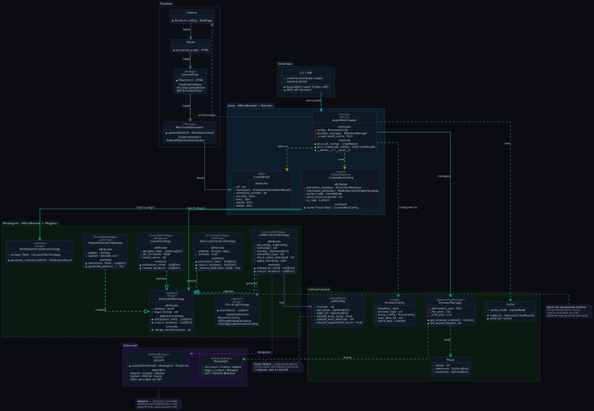

## Relatório de Análise: Arquitetura e Modelagem

## 1. Padrões Arquiteturais Identificados
 
### Strategy
 
Principal padrão do projeto. A interface *ExtractionStrategy* define o contrato de extração e permite trocar algoritmos em tempo de execução sem alterar o crawler. Subclasses implementadas: *LLMExtractionStrategy*, *JsonCssExtractionStrategy*, *CosineStrategy*, *RegexExtractionStrategy*.
 
### Adapter — LiteLLM
 
A biblioteca LiteLLM exerce o papel de Adapter, traduzindo a chamada uniforme do Crawl4AI para a interface específica de cada provider (OpenAI, Claude, Ollama, Gemini e outros). `LLMConfig` é um Value Object: encapsula apenas configuração, sem realizar adaptação.
 
### Facade
 
*AsyncWebCrawler* atua como Facade, expondo uma API simples (`arun()`, `arun_many()`) que orquestra internamente o *BrowserManager*, o pipeline de extração, o cache e a geração de Markdown.
 
### Factory / Config
 
*BrowserConfig* e *CrawlerRunConfig* atuam como objetos de configuração no padrão Parameter Object / Factory, separando a criação e configuração de comportamento da execução.
 
### Template Method
 
*ExtractionStrategy* define `run()` e `extract()` como métodos base. As subclasses implementam a lógica específica. O fluxo geral (chunking → extract → combine) é definido na classe pai.
 
### Microkernel
 
*AsyncWebCrawler* é o kernel (core estável de orquestração). As strategies (`ExtractionStrategy`, `MarkdownGenerationStrategy`, `ChunkingStrategy`) são os plugins — registrados via *CrawlerRunConfig* e substituíveis sem tocar no core.
 
### Pipeline
 
Processamento em cadeia: HTML → ContentFilter (Pruning/BM25) → MarkdownGenerator → ExtractionStrategy → CrawlResult. Cada etapa é desacoplada e pode ser trocada ou omitida via *CrawlerRunConfig*. Complementa o Microkernel definindo o fluxo interno.
 
---
 
## 2. Diagrama de Classes UML
 
O diagrama abaixo representa o isolamento entre a camada de negócio/orquestração e a camada de IA/abstração LLM.

 
## 3. Avaliação do Desacoplamento da Camada de IA
 
A camada de IA apresenta bom nível de desacoplamento, com abstração da API de LLM por meio de LLMConfig e LiteLLM, reduzindo dependências diretas. A interface de extração, baseada em ExtractionStrategy, e a injeção via CrawlerRunConfig garantem alta flexibilidade e modularidade.

As subclasses seguem o princípio da substituibilidade, permitindo reutilização e extensão das estratégias. A coesão e a testabilidade são médias, favorecidas pela separação de responsabilidades e uso de interfaces.

O acoplamento ao navegador também é médio, pois o BrowserManager abstrai o uso do Playwright. Já o vazamento de detalhes da LLM para a lógica de negócio é baixo, ficando restrito à LLMExtractionStrategy.

---
 
## 4. Alinhamento CMMI e MPS.BR
 
### CMMI — Solução Técnica (TS)
 
- O projeto usa padrões arquiteturais consolidados (Strategy, Facade, Microkernel, Adapter via LiteLLM), evidenciando decisão de design documentada.
- O diagrama UML de classes representa o "design product component" exigido pelo TS SP 2.2.
- A arquitetura Microkernel (core + plugins via Strategy) demonstra separação de preocupações e justificativa de decisão técnica (TS SP 1.2).
- As interfaces `ExtractionStrategy` satisfazem o critério de design para reutilização (TS SP 2.1).
- Ponto de melhoria: ausência de documentação formal de ADRs (Architecture Decision Records) no repositório.
### MPS.BR — Projeto e Construção (PJR/CON)
 
- Estrutura modular em `/crawl4ai` com separação clara de responsabilidades (CON — Construção).
- Uso de `pyproject.toml`, `setup.cfg` e dependências declaradas — evidência de PJR (Planejamento de Projeto).
- `Dockerfile` e `docker-compose` para implantação reproduzível (PJR — Controle de Versão/Infraestrutura).
- Testes em `/tests` e scripts de webhook demonstram preocupação com verificação (CON SP).
- Ponto de melhoria: cobertura de testes não explicitada; sem CI coverage badge visível.
---