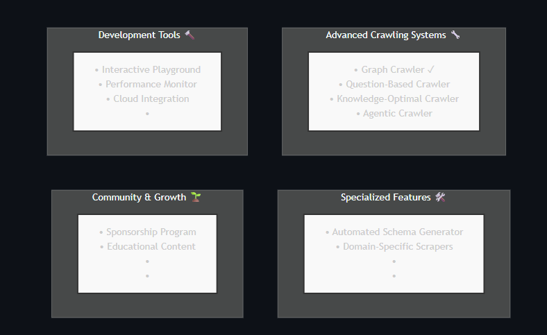
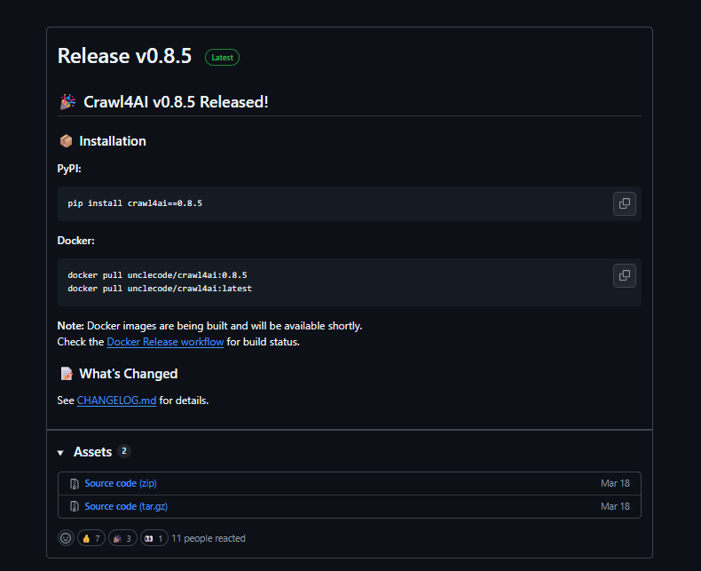
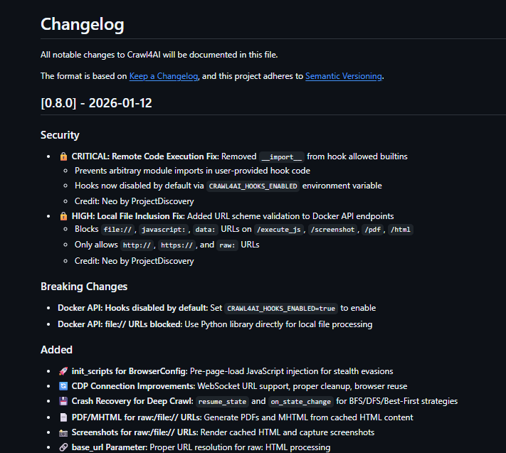
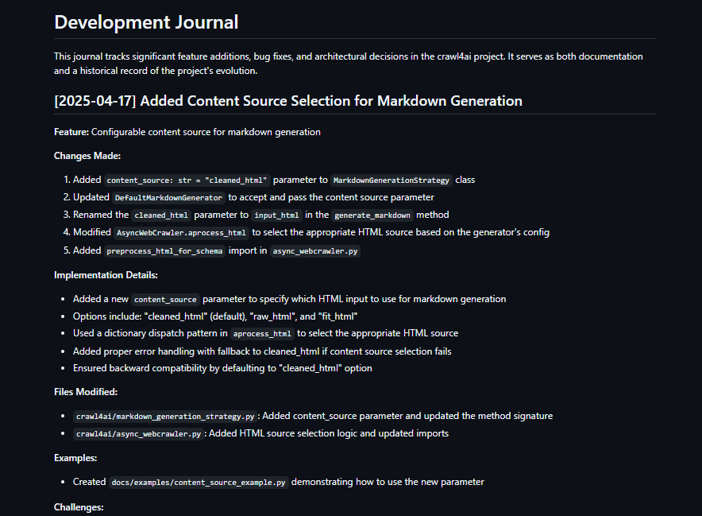
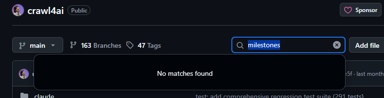

# Relatório de Análise: Ciclo de Vida e Metodologias Ágeis

## 1. Introdução
O objetivo desse relatório é analisar os processos de Gerência de Projetos (GPR) do Crawl4AI, comparando-os aos requisitos de planejamento e controle presentes nos modelos MPS.BR (Nível G) e CMMI. O foco da análise está em entender como o planejamento estratégico é colocado em prática na execução técnica, principalmente em um ambiente sujeito a constantes mudanças.

## 2. Planeamento Estratégico e Escopo
O planeamento de longo prazo do projeto está centralizado no arquivo 'ROADMAP.md'.
- **Estrutura:** O ROADMAP divide-se em quatro seções principais: Advanced Crawling Systems, Specialized Features, Development Tools e Community & Growth.

- **Abordagem do Planejamento:** Observa-se um planeamento focado nas funcionalidades, mas que carece de cronogramas explícitos, estimativas de esforço ou prazos definidos, características fundamentais para o alinhamento com o CMMI.

## 3. Ritmo de Entrega e Ciclo de Vida
A análise do histórico de versões revela um ciclo de vida ágil, iterativo e com entregas contínuas:
- **Frequência:** O projeto apresenta uma frequência alta e um ritmo rápido de lançamentos, com atualizações significativas quase mensalmente como a v0.8.0 em janeiro e a v0.8.5 em março de 2026 (essa sendo a ultima lançada até a analise feita em Abril de 2026).

- **Rastreabilidade:** O projeto utiliza versionamento semântico e mantém registros detalhados das alterações nos arquivos CHANGELOG.md e JOURNAL.md, o que contribui para o controle de configuração do produto.

## 4. Inexistência de Ferramentas de Gestão Administrativa
Um ponto determinante desta análise é a ausência total de utilização das ferramentas nativas de gestão do GitHub para fins administrativos:
- **Milestones:** Observa-se que a aba de Milestones está vazia, o que indica que não foram definidos marcos temporais ou metas no repositório.

- **GitHub Projects:** Não há utilização de GitHub Projects ou quadros Kanban para o acompanhamento das atividades e do progresso do projeto.
Dessa forma, percebe-se que o controle está sendo realizado principalmente de maneira técnica, por meio dos commits e das revisões de Pull Requests, sem uma estrutura de gestão administrativa visível.

## 5. Gestão de Riscos Técnicos
A gestão de riscos foca-se na resiliência do software perante fatores externos:
- **Dependência de LLMs:** O risco de mudanças nas APIs de terceiros (OpenAI, Anthropic) é reduzido por uma arquitetura multidependente e flexível através do LLMConfig.
- **Segurança:** O projeto demonstra uma resposta rápida na correção de falhas importantes, como vulnerabilidades críticas de segurança (como RCE e LFI), resolvendo esses problemas em pouco tempo após serem identificados.
- **Ambiente Hostil:** A adição de sistemas de detecção de anti-bot e mecanismos de fallback na versão v0.8.5 demonstra que a equipe se antecipou a possíveis falhas durante a execução do projeto.